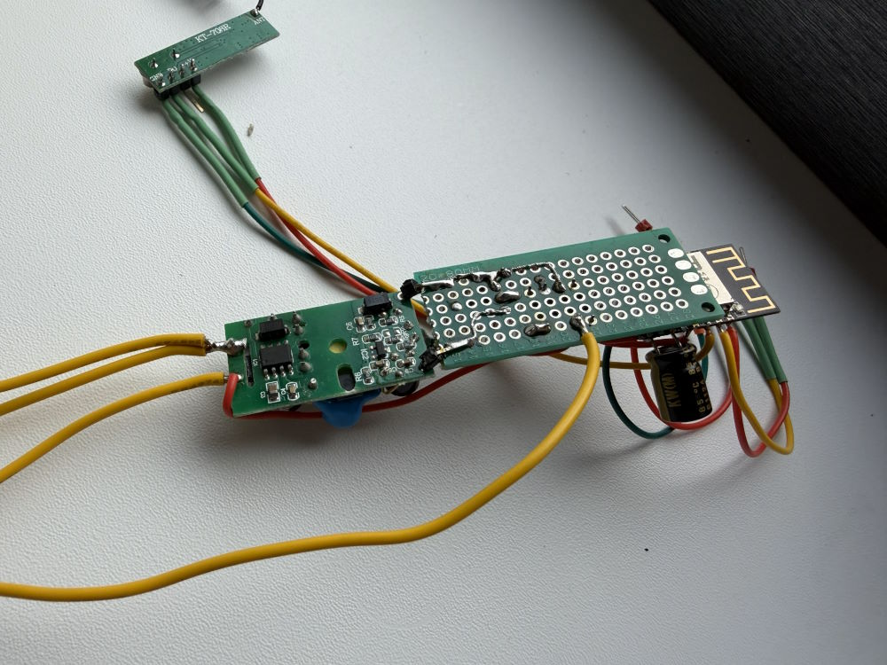
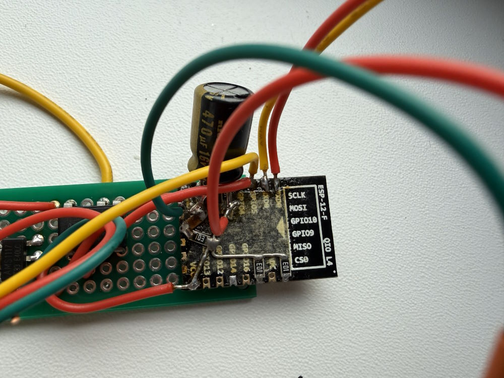

# ESP8266MOD Bathroom LED Controller

Small ESP8266 (NodeMCU/ESP‑12) firmware that:
- Drives a solid‑state relay to switch bathroom lighting.
- Exposes a tiny REST API (`/relay`, `/health`, `/`) for control and status.
- Hosts an OTA update endpoint.
- Implements a network watchdog that pings a main server every 10 s and sends Wake‑on‑LAN packets until the server responds.

## Hardware
- Board: NodeMCU 0.9 (ESP‑12 Module, ESP8266).
- Relay output pin: `D1 / GPIO5`.
- RF module input pin: `D2 / GPIO4`.
- Status LED: `LED_BUILTIN`.
- Static IP defaults to `192.168.100.27` (configurable in `WiFiHelper::configureStaticIp`).

Reference docs and photos are in `docs/`:
- 
- 
- Pinout notes: [docs/pinout.md](docs/pinout.md)
- ESP12 reference PDF: [docs/ESP12-ESP8266.pdf](docs/ESP12-ESP8266.pdf)

## Software layout
- `src/ESP8266MODBathroomLED.cpp` — main sketch, HTTP handlers, relay control.
- `src/Watchdog.cpp` / `include/Watchdog.h` — async ping + WoL state machine.
- `lib/afutils` — helpers for Wi‑Fi, server, and UDP JSON logging.
- `include/secrets.h` — **you must provide** Wi‑Fi credentials (`LOCAL_SSID`, `LOCAL_KEY`).

## Building & flashing
Prereqs: PlatformIO CLI and a USB connection to the board.

1) Install deps (handled automatically via `platformio.ini`):
   - `bblanchon/ArduinoJson@^7.4.2`
   - `akajes/AsyncPing(esp8266)@^1.1.0`
2) Build / upload:
```bash
powershell -Command "C:\Users\Defendor\.platformio\penv\Scripts\platformio.exe run"
powershell -Command "C:\Users\Defendor\.platformio\penv\Scripts\platformio.exe run --target upload"
```
3) Optional: open serial monitor at 115200 baud for logs.

## HTTP API
- `GET /health` → `{ "status": "UP" }`
- `GET /relay` → `{ "on": true|false }`
- `POST /relay` with JSON body:
  - `{"on": true}` turns relay on.
  - `{"on": true, "timeoutMs": 5000}` turns on and auto‑off after timeout.
  - `{"on": false}` turns relay off and cancels any pending timeout.

## Watchdog behavior
- Constructor (see `ESP8266MODBathroomLED.cpp`):  
  `Watchdog watchdog("48:2A:E3:20:D6:81", "192.168.100.2", "192.168.100.255", 9);`
- Every 10 s:
  1) Async ping `192.168.100.2`.
  2) If unreachable, send WoL magic packet to broadcast `192.168.100.255:9`.
  3) Repeat until the server answers.

## Development notes
- Default loop continues servicing Wi‑Fi, HTTP server, watchdog, then relay timeout logic.
- Exceptions enabled via `-DPIO_FRAMEWORK_ARDUINO_ENABLE_EXCEPTIONS`.
- Uses LWIP low‑memory profile (`-DPIO_FRAMEWORK_ARDUINO_LWIP2_LOW_MEMORY`).

## Getting started quickly
1) Copy `include/secrets.h.example` to `include/secrets.h` (or create) and fill SSID/key.
2) Adjust static IPs or MAC/broadcast in `ESP8266MODBathroomLED.cpp` if your LAN differs.
3) `platformio run --target upload`.
4) Hit `http://<device-ip>/health` to confirm, then test `/relay`.

## Folder map
- `src/` — firmware sources
- `include/` — headers (public)
- `lib/` — local libraries
- `docs/` — hardware photos, pinout, reference PDF
- `test/` — PlatformIO test scaffold
